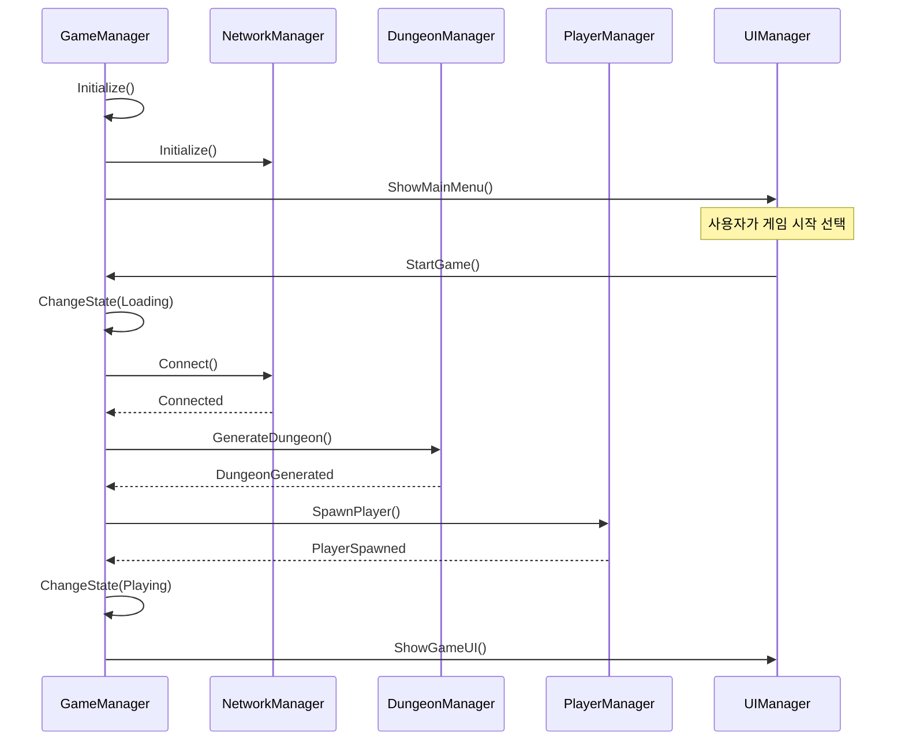
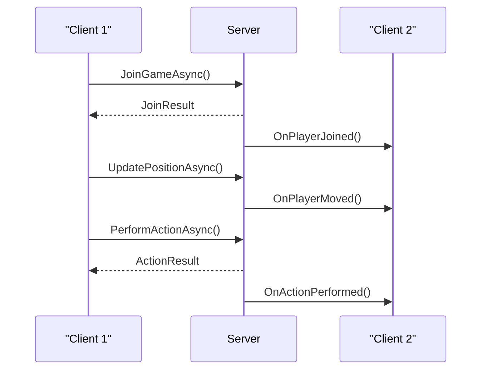

# 프로젝트 구조 및 아키텍처

## 기본 폴더 구조

```
Assets/
├── Plugins/
│   ├── MagicOnion/
│   └── MessagePack/
├── Resources/
│   ├── Prefabs/
│   ├── Materials/
│   ├── Models/
│   ├── Textures/
│   └── ScriptableObjects/
├── Scenes/
│   ├── MainMenu.unity
│   ├── Loading.unity
│   ├── Dungeon.unity
│   └── TestScenes/
├── Scripts/
│   ├── Core/
│   │   ├── AssemblyInfo.cs
│   │   ├── Singleton.cs
│   │   ├── ObjectPooling.cs
│   │   └── Extensions/
│   ├── Dungeon/
│   │   ├── AssemblyInfo.cs
│   │   ├── Generation/
│   │   ├── Visualization/
│   │   └── Interaction/
│   ├── Gameplay/
│   │   ├── AssemblyInfo.cs
│   │   ├── Character/
│   │   ├── Combat/
│   │   ├── Items/
│   │   └── AI/
│   ├── Network/
│   │   ├── AssemblyInfo.cs
│   │   ├── MagicOnion/
│   │   ├── Shared/
│   │   └── Synchronization/
│   └── UI/
│       ├── AssemblyInfo.cs
│       ├── HUD/
│       ├── Menus/
│       └── Utilities/
└── Settings/
    ├── Project.json
    └── ScriptTemplates/
```

## 어셈블리 구조

프로젝트는 모듈화와 의존성 관리를 위해 다음과 같은 어셈블리로 구성됩니다:

```
DungeonCrawler.Core
DungeonCrawler.Dungeon
DungeonCrawler.Gameplay
DungeonCrawler.Network
DungeonCrawler.UI
```

### 어셈블리 정의 파일 예시

```csharp
// DungeonCrawler.Core.asmdef
{
    "name": "DungeonCrawler.Core",
    "rootNamespace": "DungeonCrawler.Core",
    "references": [],
    "includePlatforms": [],
    "excludePlatforms": [],
    "allowUnsafeCode": false,
    "overrideReferences": false,
    "precompiledReferences": [],
    "autoReferenced": true,
    "defineConstraints": [],
    "versionDefines": [],
    "noEngineReferences": false
}

// DungeonCrawler.Dungeon.asmdef
{
    "name": "DungeonCrawler.Dungeon",
    "rootNamespace": "DungeonCrawler.Dungeon",
    "references": [
        "DungeonCrawler.Core"
    ],
    "includePlatforms": [],
    "excludePlatforms": [],
    "allowUnsafeCode": false,
    "overrideReferences": false,
    "precompiledReferences": [],
    "autoReferenced": true,
    "defineConstraints": [],
    "versionDefines": [],
    "noEngineReferences": false
}

// DungeonCrawler.Network.asmdef
{
    "name": "DungeonCrawler.Network",
    "rootNamespace": "DungeonCrawler.Network",
    "references": [
        "DungeonCrawler.Core",
        "MagicOnion",
        "MessagePack"
    ],
    "includePlatforms": [],
    "excludePlatforms": [],
    "allowUnsafeCode": false,
    "overrideReferences": false,
    "precompiledReferences": [],
    "autoReferenced": true,
    "defineConstraints": [],
    "versionDefines": [],
    "noEngineReferences": false
}
```

## 아키텍처 다이어그램

```
+-------------------+         +-------------------+
|    GameManager    |<------->|   DungeonManager  |
+-------------------+         +-------------------+
         ^                             ^
         |                             |
         v                             v
+-------------------+         +-------------------+
|   PlayerManager   |<------->|    NetworkManager |
+-------------------+         +-------------------+
         ^                             ^
         |                             |
         v                             v
+-------------------+         +-------------------+
|     UIManager     |<------->|  InventoryManager |
+-------------------+         +-------------------+
```

## 주요 시스템 간 상호작용

### 게임 초기화 시퀀스



### 네트워크 동기화 흐름



## 디자인 패턴 적용

1. **싱글톤 패턴**: 전역 접근이 필요한 관리자 클래스에 적용
   - GameManager, NetworkManager, UIManager 등

2. **옵저버 패턴**: 이벤트 기반 시스템에 적용
   - 던전 생성 완료, 플레이어 액션 수행, 네트워크 이벤트 등

3. **상태 패턴**: 게임 상태 관리 및 AI 행동에 적용
   - 게임 상태(메뉴, 로딩, 플레이, 일시 정지 등)
   - 몬스터 AI 상태(순찰, 추적, 공격, 도망 등)

4. **팩토리 패턴**: 오브젝트 생성에 적용
   - 던전 요소 생성(방, 복도, 함정 등)
   - 몬스터 및 아이템 생성

5. **커맨드 패턴**: 플레이어 입력 및 액션에 적용
   - 이동, 공격, 아이템 사용 등의 명령 캡슐화

6. **스트래티지 패턴**: 알고리즘 교체가 필요한 부분에 적용
   - 던전 생성 알고리즘
   - AI 행동 전략

## ScriptableObject 활용

### 던전 생성 설정

```csharp
[CreateAssetMenu(fileName = "DungeonSettings", menuName = "DungeonCrawler/Dungeon Settings")]
public class DungeonGenerationSettings : ScriptableObject
{
    [Header("Dungeon Size")]
    public int Width = 100;
    public int Height = 100;
    
    [Header("Room Settings")]
    public int MinRoomSize = 5;
    public int MaxRoomSize = 15;
    public int RoomPadding = 2;
    
    [Header("BSP Settings")]
    public int MaxDepth = 5;
    public float SplitRandomness = 0.3f;
    
    [Header("Special Rooms")]
    public bool GenerateEntranceRoom = true;
    public bool GenerateExitRoom = true;
    public int TreasureRoomCount = 2;
}
```

### 캐릭터 능력치 설정

```csharp
[CreateAssetMenu(fileName = "CharacterClass", menuName = "DungeonCrawler/Character Class")]
public class CharacterClassData : ScriptableObject
{
    public string ClassName;
    public Sprite ClassIcon;
    public GameObject CharacterPrefab;
    
    [Header("Base Stats")]
    public int BaseHealth = 100;
    public int BaseStamina = 100;
    public float MoveSpeed = 5f;
    public float AttackSpeed = 1f;
    
    [Header("Combat")]
    public int BaseDamage = 10;
    public float AttackRange = 2f;
    public List<SkillData> StartingSkills;
    
    [Header("Progression")]
    public AnimationCurve LevelProgressionCurve;
    public List<StatGrowth> StatGrowthRates;
}
```

### 몬스터 설정

```csharp
[CreateAssetMenu(fileName = "MonsterType", menuName = "DungeonCrawler/Monster Type")]
public class MonsterData : ScriptableObject
{
    public string MonsterName;
    public GameObject MonsterPrefab;
    public MonsterType Type;
    
    [Header("Stats")]
    public int Health = 50;
    public float MoveSpeed = 3f;
    public int Damage = 5;
    public float AttackRange = 1.5f;
    public float DetectionRange = 8f;
    
    [Header("Behavior")]
    public AIBehaviorType DefaultBehavior;
    public bool IsAggressive = true;
    public bool CanPatrol = true;
    public float PatrolRadius = 5f;
    
    [Header("Rewards")]
    public int ExperienceReward = 10;
    public List<LootDrop> PossibleLoot;
    public float LootDropChance = 0.5f;
}
```

## 확장성 고려사항

1. **모듈식 던전 생성 시스템**
   - 다양한 알고리즘을 플러그인 방식으로 교체 가능
   - 테마와 스타일을 분리하여 다양한 조합 가능

2. **컴포넌트 기반 게임플레이**
   - 캐릭터 및 적 동작을 모듈식 컴포넌트로 구성
   - 새로운 능력이나 행동을 쉽게 추가 가능

3. **네트워크 레이어 추상화**
   - MagicOnion에 직접 의존하지 않는 인터페이스 설계
   - 필요시 다른 네트워크 라이브러리로 교체 가능

4. **데이터 중심 설계**
   - 게임 로직과 데이터 분리
   - ScriptableObject를 통한 에디터 내 데이터 관리
   - 런타임 시 데이터 로딩 및 적용 시스템