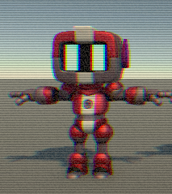

# Breadcrumbs
> Just dropping some breadcrumbs from my Unity6 + GitHub adventures.
- 2024/04/25: 새로 추가된 시스템 테스중..
  - 조사 처리 유틸리티 추가
- 2024/04/24: 중복 시스템 제거 및 사양서에 따른 구현 추가중.
  - 스킬 시스템 추가
  - 인벤토리 시스템 추가
  - 일부 오류 주석 처리
- 2024/04/23: Claude.ai를 활용한 리렉토링 테스트.
  - MCP 관련 기능 테스트 / Claude Desktop 에서 mcp 사용이 제대로 안될때가 있음 :(
- 2024/04/21: 인벤토리, 아이템, 루팅 시스템 초안 추가.
- 2024/04/20: 스폰시스템 추가.
- 2025/04/18: 플레이어 컨트롤 시스템 추가.
  - 입력 설정 변경 관련 ui 테스트. (유니티 새 입력 시스템)
    - 입력 형식 중 컴포지트 형식은 입력 받기가 안되나봄?
- 2025/04/17: 확률기반 새 ai 이동 및 공격 시스템 테스트.
  - todo: 이동 및 공격 시스템이 별도로 있는데.. 흠 공격 처리 부분이 별로임
  - README 날짜 오류 수정 :P
- 2025/04/16: ai 이동 관련 fsm 처리 테스트
- 2025/04/15: 애니메이션 처리 관련 테스트
  - nav mesh 생성 수정.
- 2025/04/14: 히트박스 관련 컴포넌트 추가
  - git local commit 무시 테스트 (rider)
  - git commit 합치기(?) 테스트 실패
- 2025/04/11: one page dungeon 맵 생성 테스트
  - edge 생성 및 탐험 테스트
  - TODO: 관련 캐릭터 컨트롤러 및 카메라
- 2025/04/10: 던전 벽 프리펩 생성. (with ProBuilder)
- 2025/04/08: one page dungeon 데이터 이해 및 데이터 생성을 위한 테스트
  - Rects 형식 수정 (rotunda 플래그 추가)
  - KayKit Dungone Pack 에셋으로 룸 생성 테스트 -> Rects(룸?) 단위 생성 처리는 맞지 않는 것 같음.
    - Rects 영역 설정에 의해 외벽 쪽으로 설정 되도록 수정 해야 할듯.
    - 벽 생성세 임의 값 사용 부분 수정 필요 할듯?
  - gpg키를 사용한 커밋을 하려면 gpg4win 인증서 관리 프로그램을 실행 해야함.
- 2025/04/05: one page dungeon 데이터 이해를 위한 테스트 코드.
- 2025/04/03: gpgsign 적용 테스트. commit 시 `Verified` 표시 되는 설정 완료.
  - gpg4win 를 사용한 키 발급 및 github에 gpg 공개키 설정.
  - 발급받은 키를 사용한 git commit 설정 처리.
  - 참고: gpg4win, Kleopatra
  - Github Desktop passed.
  - Rider passed.
- 2025/04/03: 텍스쳐 쉐이더 테스트
- 2025/03/21: ai 캐릭터 연기 지침 테스트
- 2025/03/19: lm studio api 요청 테스트 (git rebase 뭔가 잘못했나? 브렌치 모양이 이상해졌네)
- 2025/03/18: git rebase, arrow with dots entity fk!
- let's git rebase test ! :) yo~
- day23: AutoDeath 동작 오류 수정. (로컬 커밋 2회후 푸시 테스트)
- day22: um.. ObjectPoolManager buggy :P
  (테스트 코드의 필요성+1)
- day21: day20 ArrowLauncher 수정.
- day20: working on arrow card? v2 :P
- day19: Anyway, try adding lasers and arrows... 
  (Now, I'm going to trim what's made of Ai.)
- day18: 쉐이더 작업 해보기.. 흠~
- day17: custom post processing 테스트
  (유니티6 부터는 이전에 사용하던 RenderPass 부분 사용하지 않도록 변경됨, RenderGraph 사용하도록 권장함)
  (쉐이더 그래프를 통해서 효과 제작도 가능. Blit용 쉐이더 인자만 통일해 주면 FullScreen 쉐이더로 대응됨)

- day16: 캐릭터 설정 연습.
- day15: trying.. Flow Field
- day14: play with UniGif (자잘하게 뷰어와 다른 부분들이 많음)
- day13: sensor attempt #1
- day12: play with Unity Behavior #2 and Trying Cursor AI
- day11: play with Unity Behavior #1
- day10: Netcode For GameObjects 테스트 with Jammo-Character :)
   - https://github.com/mixandjam/Jammo-Character (캐릭터 github, 에셋 스토어에서도 사용가능)
- day9: TypeCache 에디터 상에서 타입 및 속성을 캐싱해주는 기능.. 툴 제작시 유용할듯!
- day8: Potential Field + ORCA 데모 (use RVO2 Library)
   - 유닛의 이동을 자연스럽게 하기 위한 알고리즘 적용 (여러가지 있지만 그중 하나..)
   - box 형식의 장애물에서 이상하게 동작 (추가 처리가 필요한가?!)
- day7: 옛날 네트워크 플레이 방식 테스트
   - UniTask Nuget을 통해서 설치하면 'error CS0117: 'UniTask' does not contain a definition for 'Delay'' 에러 발생
      - 유니티 패키지 매니저를 통해 설치 할것을 권장함 (https://github.com/Cysharp/UniTask/issues/334)
   - 제대로 동작 하려면 클라이언트 백그라운드에서 실행 되도록 설정 해야함. (별도 스레드로 하면 필요 없을지도..)
   - 예외처리 필요
- day6: need own tiles! practice with tilemap... oh well it's a mess.. ha!
- day5: animation setting practice (It's so bad and a mess >_<)
- day4: jumping in day3 :P
- day3: 2d dungeon generation
- day2: sdf in texture.. :P
- day1: outline image
